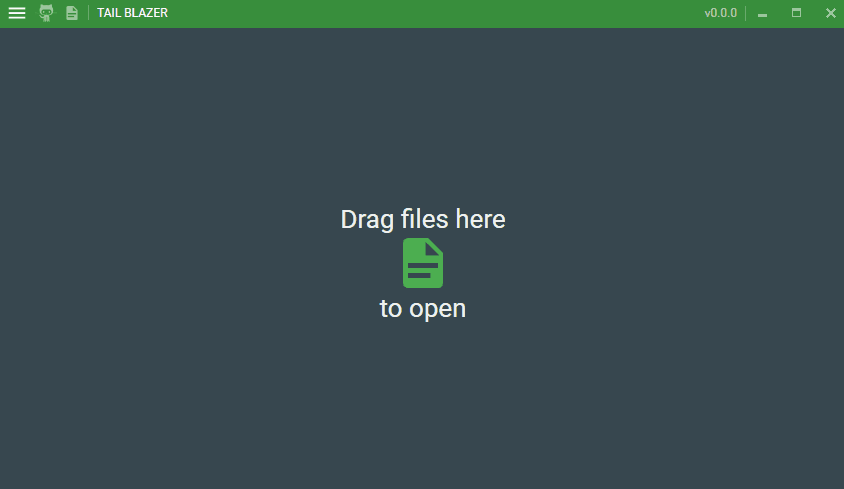
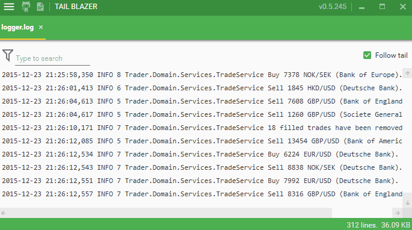
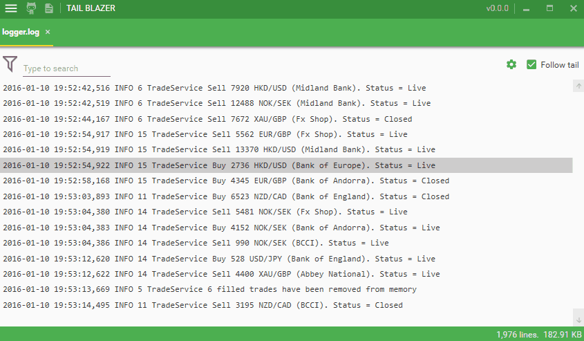
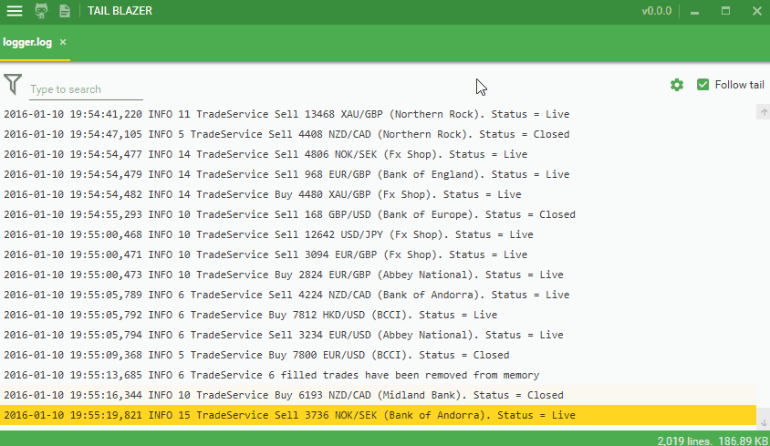

# Tail Blazer

   

  

In my day to day professional life I am always tailing log files but have always been disappointed with the utilities on offer. The current crop of free ones all look like they were written in the 1990s, are very ugly and have limited functionality.

So I have decided to rectify this by creating a more modern version.  The mission statement is:  

>It has to be fast, intuitive, functionally rich and the code has to be 100% reactive.

After several months of sacrificing my free time, Tail Blazer is finally begining to have a polished feel to it:  

And I believe now that it is begining to look good.

## Current feature list

 - Drag and drop to tail a file
 - Virtual file scrolling
 - Highlight new lines (can be disabled)
 - Side by side monitoring of files
 - Auto tail or scroll mode
 - Filter lines to match text
 - Conditionally highlight text
 - Highlight text in different colours
 - Highlight rows using different images
 - Filter or highlight using regex
 - Global and local search and Highlighting
 - Apply multiple searches and toogle between search results
 - View search result in original position in file
 - Copy to clipboard
 - Handle extemely large files (I have opened a 45 Gb file)
 - Dark and light theme
 - Remembers all your settings
 
## Future feature list

 - Conditional Alerts
 - Automatic creation of columns
 - Pipe filter to file
 - Plug in to external providers (see [#51](https://github.com/RolandPheasant/TailBlazer/issues/51))
 - Search and tail entire folder

## Feature requests and any other issues

Feel free to get involved by reporting issues and submitting a feature request. Feedback is welcome and and is required to make this a first class system. But before raising an issue check out [issues](https://github.com/RolandPheasant/TailBlazer/issues) to see whether one has already been raised.  

## Download Tail Blazer

 - Fork, clone or download the source code and build using Visual Studio 2015
 - Install it via [Chocolatey](https://chocolatey.org/packages/tailblazer)
 - Grab the binaries from the [release page](https://github.com/RolandPheasant/TailBlazer/releases), extract and double click TailBlazer.exe to run.

## Very large files and fast scrolling

Tail Blazer can easily handle a file of any size. The largest file I have tested was 47 Gb which was the maximum file size I could create before my disk would become full.

## User Settings

Don't like the light background? Change it to dark.

Text too small? Then zoom.

Don't like new line highlight? Turn it off. 

## Roll call of honour

For me to produce this application I have used several community led open source projects all of which I love. So if you like this app I recommend checking out the following.

 - [Dynamic Data](https://github.com/RolandPheasant/DynamicData) Rx based collections developed by me.
 - [Material Design ToolKit](https://github.com/ButchersBoy/MaterialDesignInXamlToolkit) by my friend and work colleage ButchersBoy. This brings WPF into the 21st century.
 - [Dragablz](https://github.com/ButchersBoy/Dragablz)  also by ButchersBoy. I think he is showing off now.
 - [MahApps](https://github.com/MahApps/MahApps.Metro) which was the first open source project to make WPF truly modern.
 - [Structure Map](https://github.com/structuremap/structuremap) which is a dependency injection library which defines what a good API is all about.

I have used more projects than these but these are the ones which I feel to be indispensable for any desk top project.
